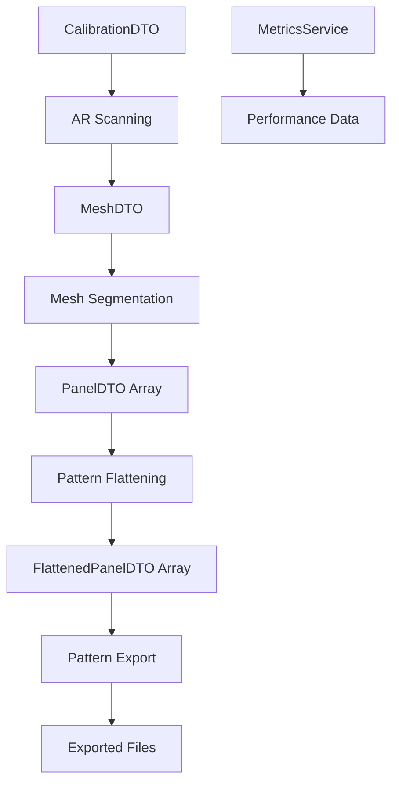

# CoverCraft Architecture Documentation

## System Overview
CoverCraft is a modular iOS application for creating custom sewing patterns from LiDAR scans. The architecture follows strict separation of concerns with 8 distinct modules.

## Module Architecture

### 1. CoverCraftDTO (Data Transfer Objects)
**Purpose**: Immutable, versioned data contracts between modules
- `MeshDTO`: 3D mesh representation
- `PanelDTO`: Segmented mesh panels  
- `FlattenedPanelDTO`: 2D pattern pieces
- `CalibrationDTO`: Camera/measurement calibration
- All DTOs include versioning and validation

### 2. CoverCraftCore (Infrastructure)
**Purpose**: Shared utilities, dependency injection, protocols
- `ServiceContainer`: Thread-safe dependency injection
- `MetricsService`: Application monitoring and telemetry
- Service protocols for all business logic
- Comprehensive error handling

### 3. CoverCraftAR (AR Scanning)
**Purpose**: LiDAR scanning and 3D mesh capture
- ARKit integration for mesh capture
- Real-time surface detection
- Mesh optimization and filtering

### 4. CoverCraftSegmentation (Mesh Processing)
**Purpose**: Intelligent mesh segmentation into pattern panels
- K-means clustering algorithms
- Surface normal analysis
- Connected component segmentation

### 5. CoverCraftFlattening (Pattern Creation)
**Purpose**: 3D to 2D pattern flattening
- UV mapping algorithms
- Distortion minimization
- Seam placement optimization

### 6. CoverCraftExport (Pattern Output)
**Purpose**: Export patterns in various formats
- PNG, PDF, SVG, GIF export
- Print-ready scaling and layout
- Pattern annotation

### 7. CoverCraftUI (User Interface)
**Purpose**: SwiftUI components and views
- AR scanning interface
- Pattern editing tools
- Export controls

### 8. CoverCraftFeature (Orchestration)
**Purpose**: Main feature coordination
- Service composition
- Workflow orchestration
- State management

## Data Flow Architecture



## Dependency Injection Pattern

### Service Registration
```swift
// In app startup
let container = DefaultDependencyContainer.shared

// Register services
container.registerSingleton({
    DefaultARScanningService()
}, for: ARScanningService.self)

container.registerSingleton({
    DefaultMeshSegmentationService()
}, for: MeshSegmentationService.self)
```

### Service Resolution
```swift
// In views/services
@Environment(\.dependencyContainer) private var container

private var scanningService: ARScanningService? {
    container.resolve(ARScanningService.self)
}
```

## Error Handling Strategy

### Hierarchical Error Types
```swift
// Base protocol
protocol CoverCraftError: LocalizedError {
    var errorCode: String { get }
    var recoverySuggestion: String? { get }
}

// Module-specific errors
enum SegmentationError: CoverCraftError {
    case invalidMesh(String)
    case segmentationFailed(String)
}
```

## Testing Architecture

### Contract Testing
- **Purpose**: Prevent breaking API changes
- **Location**: `Tests/ContractTests/`
- **Method**: Snapshot testing of DTO serialization
- **Automation**: Runs in CI/CD on every PR

### Integration Testing
- **Purpose**: Module interaction validation
- **Scope**: End-to-end workflow testing
- **Mock Strategy**: Service protocol mocking

### Unit Testing
- **Framework**: Swift Testing with modern `@Test` syntax
- **Coverage Target**: 90%
- **Focus**: Business logic and algorithms

## Performance Architecture

### Concurrency Model
- **SwiftUI**: `@MainActor` for all UI updates
- **Services**: Actor isolation for thread safety
- **Heavy Computation**: Background queues with structured concurrency

### Memory Management
- **DTOs**: Value types (structs) for immutability
- **Services**: Reference types with careful lifecycle management
- **Large Data**: Streaming processing for mesh data

### Monitoring
- **Metrics**: MetricsService for performance tracking
- **Logging**: Structured logging with swift-log
- **Telemetry**: MetricsService for business metrics

## CI/CD Architecture

### Pipeline Stages
1. **Build Validation**: Swift package compilation
2. **Testing**: Unit, integration, and contract tests
3. **Quality Gates**: SwiftLint, SwiftFormat
4. **Security Scanning**: Dependency vulnerability checks
5. **Coverage Reporting**: Codecov integration
6. **Documentation**: DocC generation

### Deployment Strategy
- **Feature Branches**: Full CI validation
- **Main Branch**: Additional deployment checks
- **Releases**: Semantic versioning with Git tags

## Security Architecture

### Data Protection
- No persistent storage of sensitive data
- Mesh data processed in-memory only
- Export files user-controlled locations

### Dependency Security
- Weekly automated dependency scanning
- Pinned dependency versions
- Security alerts via GitHub Actions

## Scalability Considerations

### Horizontal Scaling
- Stateless service design
- Protocol-based architecture for swappable implementations
- Modular structure allows independent optimization

### Performance Optimization
- Lazy loading of heavy services
- Streaming mesh processing
- Background computation with progress reporting

## Migration Path

### Version Compatibility
- DTOs include version information
- Migration utilities for breaking changes
- Backward compatibility preservation

### Module Evolution
- New modules can be added without affecting existing ones
- Service protocols allow implementation swapping
- Contract tests prevent regression
